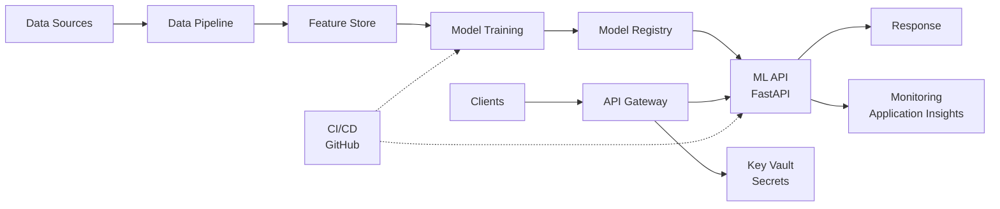

# 🏗️ Architecture

System architecture documentation for the Chronic Disease Predictor.

## Overview

The system is a complete MLOps pipeline that spans data ingestion, model training, deployment, and monitoring. Each component is containerized and deployed on Azure.

## High-Level Design
## High-Level Architecture

## Components

### 1. Data Pipeline (`src/`)

Handles all data operations from raw CSV to ML-ready features.
